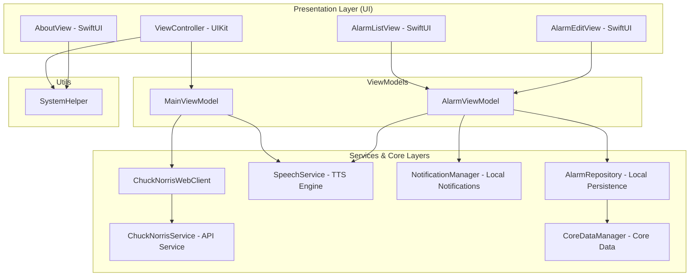

# 🤠 Chuck Norris App

The **Chuck Norris App** is a native iOS application that blends legendary Chuck Norris jokes with a fully featured, custom alarm management system.

---

## 🚀 Key Features

* **Joke Fetching**: Dynamically fetches random jokes in real-time by consuming the public `api.chucknorris.io` endpoint.
* **Text-to-Speech (TTS)**: Leverages voice synthesis via `AVSpeechSynthesizer` to narrate Chuck Norris jokes out loud.
* **Alarm Manager**:
  * Create, edit, and delete multiple custom alarms persisted locally using **Core Data**.
  * Flexible weekday selection for recurring alarms.
  * Local notification scheduling via `NotificationManager` that triggers the synthesized voice of the joke.
* **Internationalization (i18n)**: Out-of-the-box support for both **English** and **Portuguese** using localized key files.
* **Simulated Monetization**: Integrated Google AdMob banners.
* **Secrets Isolation**: Sensitives AdMob keys and unit IDs are isolated locally in `.xcconfig` configurations ignored by Git.

---

## 🏛️ Architecture Overview

The project follows a clean, decoupled design based on the **MVVM (Model-View-ViewModel)** design pattern with a hybrid user interface (**UIKit** + **SwiftUI**):



* **Dependency Injection**: Centrally managed using the **Swinject** container and loaded via Storyboard (`SwinjectStoryboard`).
* **Hybrid Layout**: The primary main view and hamburger menu slide drawer are written in UIKit, whereas the Alarms and About screens are written in SwiftUI, seamlessly presented using `UIHostingController`.
* **Testing Isolation**: Key dependencies are decoupled through protocols (such as `NotificationManager`), allowing clean, decoupled testing using **Native Manual Mocks**.

---

## 📦 How to Setup and Run the App Locally

### Prerequisites
* macOS with **Xcode 15+** installed.
* **CocoaPods** installed on your system.

### Step 1: Install Dependencies
Navigate to the root directory of the project in your terminal and run:
```bash
pod install
```

### Step 2: Configure Environment Variables (Secrets)
1. Duplicate the credentials template:
   ```bash
   cp Secrets.template.xcconfig Secrets.xcconfig
   ```
2. Open `Secrets.xcconfig` and input your real credentials or keep the test defaults (this file is automatically ignored by Git).

### Step 3: Compile and Run the App
1. Open the generated **`ChuckNorrisApp.xcworkspace`** workspace in Xcode.
2. Select your desired simulator target device (e.g., *iPhone 16*).
3. Press `Cmd + R` to compile and run the application.

---

## 🧪 How to Execute Tests Locally

The app features comprehensive code coverage for unit testing and end-to-end interface testing (UI Tests) leveraging **Native Manual Mocks** and **XCTest**.

### Running from Xcode
* Open the workspace, select the main scheme, and press `Cmd + U` to run all unit and UI tests.

### Running from Terminal (Command Line)
You can build and run all test targets (Unit and UI) using `xcodebuild`:

```bash
xcodebuild -workspace ChuckNorrisApp.xcworkspace \
           -scheme ChuckNorrisApp \
           -sdk iphonesimulator \
           -destination 'platform=iOS Simulator,name=iPhone 16' \
           -enableCodeCoverage YES \
           test
```

### Checking Code Coverage
To inspect the code coverage metrics from the terminal after running tests, execute:

```bash
xcrun xccov view --report ~/Library/Developer/Xcode/DerivedData/ChuckNorrisApp-*/Logs/Test/*.xcresult | grep "ChuckNorrisApp/ChuckNorrisApp/"
```
